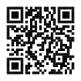

<!-- README.md is generated from README.Rmd. Please edit that file -->

# plot-your-data

R Shiny App demonstrating importance of plotting data when fitting statistical models.

## Building the app

To build the app, either

* open the project in RStudio, open `plot-your-data.Rmd` and click the *Run Document* button
* or, run the following code in R  

    ``` r
    rmarkdown::run('plot-your-data.Rmd')
    ```

## App URL

The app is served at https://remlapmot.shinyapps.io/plot-your-data/

```{r, echo=FALSE, out.width="33%"}
code <- qrcode::qr_code("https://remlapmot.shinyapps.io/plot-your-data/")
qrcode::generate_svg(
  qrcode = code,
  filename = "img/qrcode.svg",
  show = FALSE
)

```
