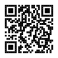

<!-- README.md is generated from README.Rmd. Please edit that file -->

# plot-your-data

R Shiny App demonstrating importance of plotting data when fitting
statistical models.

## Building the app

To build the app, either

-   open the project in RStudio, open `plot-your-data.Rmd` and click the
    *Run Document* button

-   or, run the following code in R

    ``` r
    rmarkdown::run('plot-your-data.Rmd')
    ```

## App URL

The app is served at <https://remlapmot.shinyapps.io/plot-your-data/>



### To deploy (and update) to shinyapps.io

-   Click the *Publish* button (blue circle in top right corner of
    Source pane) and follow subsequent instructions or run  

-   Or, through RStudio: Tools \| Global Options \| Publishing; and
    Connect shinyapps.io account

    ``` r
    rsconnect::deployApp()
    ```
